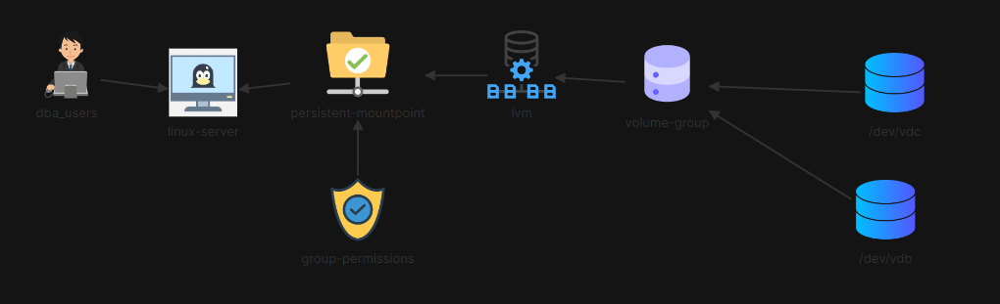

# Task: Add an LVM Volume on CentOS

## Task Overview

The database server `centos-host` is running short on space. The objective is to add an LVM volume for the Database team using some of the existing disks on this server.



Following this architecture, we're asked to :

1.  **Install the correct packages that will allow the use of "lvm" on the Centos machine.**
    
2.  **Create a group called "dba_users" and add the user called 'bob' to this group.**
    
3.  **Create a Physical Volume for "/dev/vdb" and "/dev/vdc".**
    
4.  **Create a volume group called "dba_storage" using the physical volumes "/dev/vdb" and "/dev/vdc".**
    
5.  **Create an "lvm" called "volume_1" from the volume group called "dba_storage". Make use of the entire space available in the volume group.**
    
6.  **Format the lvm volume "volume_1" as an "XFS" filesystem.**
    
7.  **Ensure that the mountpoint "/mnt/dba_storage" has the group ownership set to the "dba_users".**


## Solution

The following steps outline the process to achieve the task:

### 1. Create a Group and Add User
First, create a group called `dba_users` and add the user `bob` to this group.

```bash
groupadd dba_users
usermod -G dba_users bob
```


### 2. Install LVM Packages

Install the necessary packages that allow the use of LVM on the CentOS machine.

```bash
sudo yum install lvm2
```

### 3. Create Physical Volumes

Create physical volumes on the disks `/dev/vdb` and `/dev/vdc`.

```bash
pvcreate /dev/vdb
pvcreate /dev/vdc
```

### 4. Create a Volume Group

Create a volume group called `dba_storage` using the physical volumes `/dev/vdb` and `/dev/vdc`.

```bash
vgcreate dba_storage /dev/vdb /dev/vdc
```
### 5. Create a Logical Volume

Create a logical volume called `volume_1` from the `dba_storage` volume group. Utilize the entire space available in the volume group.

```bash
lvcreate -l +100%FREE -n volume_1 dba_storage
```

### 6. Format the Logical Volume

Format the logical volume `volume_1` as an XFS filesystem.

```bash
mkfs.xfs /dev/mapper/dba_storage-volume_1
```

### 7. Create a Mount Point and Mount the Volume

Create the mount point `/mnt/dba_storage` and mount the logical volume.

```bash
mkdir -p /mnt/dba_storage
mount /dev/mapper/dba_storage-volume_1 /mnt/dba_storage
``` 

### 8. Update /etc/fstab

To ensure the volume is mounted automatically at boot, add the following entry to `/etc/fstab`:

```bash
vi /etc/fstab
```

Add this line: `/dev/mapper/dba_storage-volume_1 /mnt/dba_storage xfs defaults 0 0` 

### 9. Set Group Ownership and Permissions

Ensure that the mount point `/mnt/dba_storage` has the group ownership set to `dba_users` and set the appropriate permissions.

```bash
chown :dba_users /mnt/dba_storage
chmod 770 /mnt/dba_storage
```
